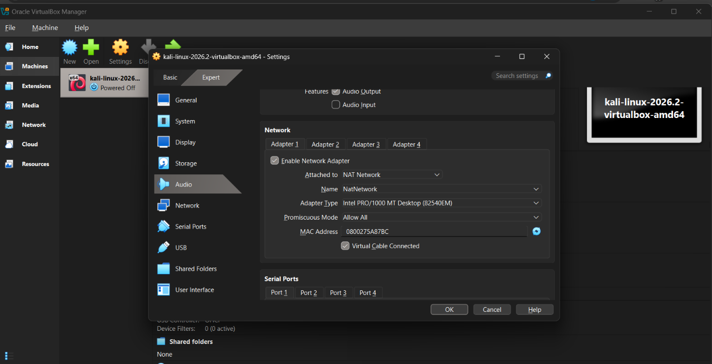
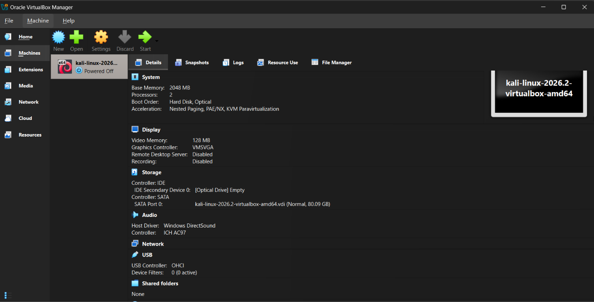
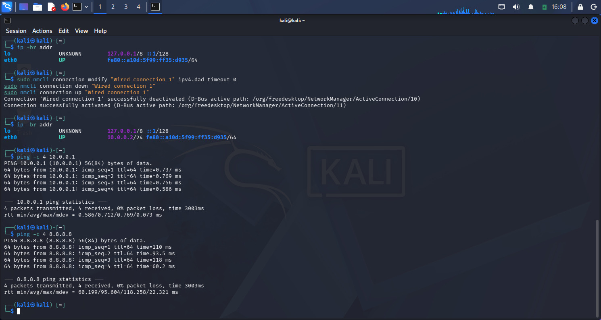

<div align="center">

# 🔐 Cybersecurity Lab Environment Setup

### Building a controlled VirtualBox + Kali Linux environment for cybersecurity experimentation

<p>
  
  
  
  
  
</p>

</div>

---

## 📌 Project Overview

This project documents the setup of my Week 01 cybersecurity laboratory using **VirtualBox** and **Kali Linux**.

The goal was not simply to install a virtual machine, but to build a **repeatable security-testing environment** with a predictable network configuration, host/guest integration, recovery points, and verified connectivity.

The lab is designed as a foundation for future work involving reconnaissance, network security, web application testing, vulnerability assessment, packet analysis, and other authorized cybersecurity exercises.

> **Note:** The order of the images may vary from the actual setup sequence. The screenshots are included as supporting evidence for the configuration and verification steps.

---

## 🎯 Objectives

The primary objectives of this lab were to:

- Install and configure VirtualBox as the virtualization platform.
- Import and configure Kali Linux as the primary security-testing VM.
- Create a dedicated **NAT Network** using `10.0.0.0/24`.
- Assign Kali a predictable address of `10.0.0.2/24`.
- Establish gateway, Internet, and DNS connectivity.
- Configure clipboard, drag-and-drop, and shared-folder integration.
- Install a matching VirtualBox Guest Additions environment.
- Create a clean VM snapshot for recovery.
- Verify the final environment using practical network and system checks.
- Document the setup so the environment can be reproduced and extended later.

---

## 🛡️ Purpose of the Lab

This laboratory provides a **controlled environment for learning and authorized security testing**.

A dedicated virtual network makes it possible to add additional machines later and build realistic attacker/target scenarios without mixing the lab directly with the host's normal network.

Potential future exercises include:

```text
Reconnaissance
      ↓
Port & Service Enumeration
      ↓
Vulnerability Assessment
      ↓
Web Security Testing
      ↓
Exploitation Practice
      ↓
Detection / Analysis
      ↓
Remediation & Reporting
```

⚠️ **Ethical Use:** All testing must be performed only against systems that I own or have explicit authorization to assess.

---

## 🧭 Original Lab Heading

### Week 01 — Lab Setup: VirtualBox and Kali Linux

This repository implements the Week 01 laboratory foundation: virtualization, Kali Linux deployment, private networking, host/guest integration, connectivity validation, and a recoverable baseline.

---

## 🏗️ Lab Architecture

```text
                         HOST MACHINE
                    Windows + VirtualBox 7.2.16
                               │
                               │
                     ──────────▼──────────
                    │      NatNetwork         │
                    │     10.0.0.0/24         │
                    │      Gateway .1         │
                     ──────────┬───────────
                               │
                         ──────▼──────
                        │  Kali Linux    │
                        │    2026.2      │
                        │  10.0.0.2/24.  │
                         ─────────────

        Future target / analysis VMs can be added later:
                  10.0.0.3 → 10.0.0.99
```

### Network Design

| Component | Configuration      |
|---|---|
| Virtual Network | `NatNetwork` |
| Network Type | NAT Network |
| IPv4 Prefix | `10.0.0.0/24` |
| Gateway | `10.0.0.1` |
| Kali Address | `10.0.0.2/24` |
| DNS | `10.0.0.1`, `8.8.8.8` |
| Future VM Range | `10.0.0.3–10.0.0.99` |

### Why NAT Network?

I selected **NAT Network** instead of a standard NAT adapter because the lab is intended to grow beyond a single VM.

It provides a practical balance:

```text
Virtual Machine ↔ Virtual Machine
        │
        └──────────────► Lab Network
                              │
                              ▼
                         NAT Gateway
                              │
                              ▼
                           Internet
```

This allows future attacker and target systems to communicate on the same controlled virtual subnet while still providing outbound connectivity.

---

## ⚙️ Lab Configuration

| 🧩 Component | ⚙️ Final Configuration |
|---|---|
| Host OS | Windows |
| Hypervisor | VirtualBox `7.2.16` |
| Security OS | Kali Linux `2026.2` |
| Kali RAM | `2048 MB` |
| Virtual Network | `NatNetwork` |
| Network Range | `10.0.0.0/24` |
| Kali IP | `10.0.0.2/24` |
| Default Gateway | `10.0.0.1` |
| DNS | `10.0.0.1`, `8.8.8.8` |
| Adapter | Intel PRO/1000 MT Desktop |
| Promiscuous Mode | Allow All |
| Clipboard | Bidirectional |
| Drag & Drop | Bidirectional |
| Shared Folder | `downloads` |
| Snapshot | Clean baseline |

---

# 🪜 Lab Setup Procedure

## Step 1. Install VirtualBox

VirtualBox was installed as the hypervisor used to create and manage the cybersecurity laboratory.

The final host version used for this project was:

```text
VirtualBox 7.2.16
```

The objective at this stage was to establish a stable virtualization platform before creating the lab network and importing Kali.

---

## Step 2. Create the NAT Network

A dedicated NAT Network named `NatNetwork` was created in VirtualBox.

```text
Network Name : NatNetwork
IPv4 Prefix  : 10.0.0.0/24
DHCP         : Enabled
IPv6         : Disabled
```



### Why `10.0.0.0/24`?

A `/24` network provides a simple and predictable private IPv4 space for the lab while leaving enough addresses for future machines.

The important addresses in this design are:

```text
10.0.0.1   → Gateway
10.0.0.2   → Kali Linux
10.0.0.3+  → Future laboratory machines
```

---

## Step 3. Import Kali Linux

Kali Linux `2026.2` was imported into VirtualBox and configured as the primary security-testing machine.

### VirtualBox Adapter Configuration

```text
Adapter 1
Attached to : NAT Network
Network     : NatNetwork
Adapter     : Intel PRO/1000 MT Desktop
Cable       : Connected
```

### Host / Guest Integration

The following integration features were configured:

```text
Shared Clipboard : Bidirectional
Drag & Drop      : Bidirectional
Shared Folder    : downloads
Auto-mount       : Enabled
Permanent        : Enabled
```



The shared `downloads` directory provides a controlled way to move required files between the host and the Kali VM during lab work.

---

## Step 4. Configure the Kali Linux Network

The Kali VM was first checked to identify the active network connection and addressing.

Useful commands:

```bash
ip -br addr
ip route
nmcli connection show
```

The active NetworkManager profile was:

```text
Wired connection 1
```

### Static IPv4 Configuration

```bash
sudo nmcli connection modify "Wired connection 1" \
  ipv4.method manual \
  ipv4.addresses 10.0.0.2/24 \
  ipv4.gateway 10.0.0.1 \
  ipv4.dns "10.0.0.1 8.8.8.8"
```

The resulting network design was:

```text
IP Address : 10.0.0.2/24
Gateway    : 10.0.0.1
DNS        : 10.0.0.1 / 8.8.8.8
```



### Why a Static IP?

A predictable Kali address simplifies:

- future target configuration,
- network diagrams,
- Nmap exercises,
- service testing,
- documentation,
- and troubleshooting.

For a cybersecurity lab, consistency is more useful than relying on a changing DHCP address.

---

## Step 5. Resolve the Network Reconfiguration Issue

After switching from DHCP to a static IPv4 configuration, the connection required an additional NetworkManager adjustment.

The configuration used was:

```bash
sudo nmcli connection modify "Wired connection 1" ipv4.dad-timeout 0

sudo nmcli connection down "Wired connection 1"

sudo nmcli connection up "Wired connection 1"
```

The interface was then rechecked:

```bash
ip -br addr
```

Expected final state:

```text
eth0   UP   10.0.0.2/24
```

This step was important because it restored the intended static network configuration without forcing or bypassing package dependencies.

---

## Step 6. Validate the Network

### Check the Interface

```bash
ip -br addr
```

### Check the Routing Table

```bash
ip route
```

Expected default route:

```text
default via 10.0.0.1 dev eth0
```

### Test the Gateway

```bash
ping -c 4 10.0.0.1
```

Result:

```text
4 packets transmitted
4 packets received
0% packet loss
```

### Test Internet Connectivity

```bash
ping -c 4 8.8.8.8
```

Result:

```text
4 packets transmitted
4 packets received
0% packet loss
```

### Test DNS Resolution

```bash
getent hosts google.com
```

A valid address was returned, confirming that hostname resolution was functioning.

---

## Step 7. Align VirtualBox Guest Additions

The initial Guest Additions environment did not match the installed VirtualBox host version, so I aligned the guest integration environment with the host.

### Host Version

```text
VirtualBox 7.2.16
```

### Guest Additions Target

```text
VirtualBox Guest Additions 7.2.16
```

The Guest Additions ISO was mounted manually:

```bash
sudo mkdir -p /mnt/vboxga
sudo mount /dev/sr0 /mnt/vboxga

ls -la /mnt/vboxga
```

The installer was then executed:

```bash
cd /mnt/vboxga
sudo sh ./VBoxLinuxAdditions.run
```

---

## Step 8. Resolve Kernel / Header Compatibility

During Guest Additions installation, the running Kali kernel did not have a matching build environment.

The original environment was checked with:

```bash
uname -r
ls -l /lib/modules/$(uname -r)/build
ls -ld /usr/src/linux-headers-$(uname -r)
```

The missing kernel-header/build dependency was identified before proceeding.

Rather than forcing an incomplete dependency chain, the available complete Kali kernel and header packages were installed:

```bash
sudo apt install -y linux-image-amd64 linux-headers-amd64
```

After rebooting, the new kernel was verified:

```bash
uname -r
```

Final kernel environment:

```text
7.1.5+kali-amd64
```

The matching build directory was present:

```text
/lib/modules/7.1.5+kali-amd64/build
```

This provided a proper environment for compiling the Guest Additions kernel modules.

---

## Step 9. Verify Guest Additions

The final Guest Additions version was checked and aligned with the host:

```text
Guest Additions : 7.2.16
Host VirtualBox : 7.2.16
```

Additional session checks included:

```bash
ps aux | grep -i VBoxClient
```

The environment was running under:

```text
Desktop : XFCE
Session : X11
```

---

## Step 10. Create a Clean Snapshot

Once the environment was configured and verified, a baseline VirtualBox snapshot was created.

The snapshot serves as a known-good restore point before future security experiments.

Conceptually:

```text
Clean Baseline
      │
      ├── Security Testing
      ├── Tool Installation
      ├── Network Experiments
      └── Configuration Changes
                │
                ▼
         Restore Baseline
```

This is especially useful when experimenting with security tooling where configuration changes may be intentional and destructive.

---

# 🔎 Lab Verification

The final environment was verified using the following checks.

| ✅ Test | 🧾 Command | 🎯 Result |
|---|---|---|
| IP address | `ip -br addr` | `10.0.0.2/24` |
| Default route | `ip route` | `10.0.0.1` |
| Gateway reachability | `ping -c 4 10.0.0.1` | PASS |
| Internet reachability | `ping -c 4 8.8.8.8` | PASS |
| DNS resolution | `getent hosts google.com` | PASS |
| Guest Additions | Version check | PASS |
| Kernel build environment | `/lib/modules/.../build` | PASS |
| Clipboard | VirtualBox settings | PASS |
| Drag & Drop | VirtualBox settings | PASS |
| Shared folder | `downloads` | PASS |
| Snapshot | Baseline snapshot | PASS |

### Network Verification Summary

```text
Kali Linux
10.0.0.2/24
     │
     ▼
Gateway
10.0.0.1
     │
     ▼
Internet
8.8.8.8
     │
     ▼
DNS
google.com → resolved
```

---

# 🐞 Problems Encountered & Solutions

Documenting real troubleshooting decisions is an important part of this project because it demonstrates how the environment was stabilized rather than simply showing the final state.

## Problem 1. Static IPv4 Reconfiguration

After applying the static address, the interface did not immediately return to the required state.

### Solution

```bash
sudo nmcli connection modify "Wired connection 1" ipv4.dad-timeout 0
sudo nmcli connection down "Wired connection 1"
sudo nmcli connection up "Wired connection 1"
```

The interface was then verified with:

```bash
ip -br addr
```

Result:

```text
eth0   UP   10.0.0.2/24
```

---

## Problem 2. Guest Additions / Kernel Build Environment

The Guest Additions installer required kernel headers and a valid kernel build path.

The environment was checked instead of assuming the required files existed:

```bash
uname -r
ls -l /lib/modules/$(uname -r)/build
```

When the exact matching header dependency chain was incomplete, I avoided forcing the installation and instead installed the complete Kali image/header pair:

```bash
sudo apt install -y linux-image-amd64 linux-headers-amd64
```

After rebooting, the kernel and headers were aligned and Guest Additions could be installed successfully.

### Key Lesson

A reproducible Linux troubleshooting process should verify:

```text
Running Kernel
      ↓
Matching Headers
      ↓
Build Directory
      ↓
Module Compilation
      ↓
Guest Integration
```

---

# 🧠 Engineering Decisions

## Predictable IP Addressing

Using `10.0.0.2/24` gives the Kali VM a stable identity inside the lab.

That becomes valuable later when documenting target systems, scanner output, attack paths, and network traffic.

## Dedicated NAT Network

A shared NAT Network provides more flexibility than a single-machine NAT setup because future virtual machines can communicate through the same laboratory segment.

## Clean Recovery Point

The snapshot is treated as an actual lab control rather than an afterthought. Future exercises can begin from a known-good environment.

## Verify Before Modifying

A recurring approach throughout the setup was:

```text
Observe
  ↓
Identify
  ↓
Modify
  ↓
Verify
```

Examples include checking `nmcli`, `ip route`, kernel information, and build paths before making changes.

---

# 💡 What I Learned

### 1. Virtual Machine Networking

I learned how VirtualBox networking modes affect communication between virtual machines and external networks.

### 2. NAT vs NAT Network

A NAT Network is useful when multiple VMs need to communicate with each other while still having outbound connectivity.

### 3. Static IPv4 Configuration

I learned how to configure and validate IPv4 addresses, gateways, routes, and DNS using NetworkManager.

### 4. Linux Kernel / Header Dependencies

I learned that kernel-module installation depends on having a compatible kernel build environment, not simply the installer itself.

### 5. Guest Integration

VirtualBox Guest Additions provide the integration layer needed for practical host/guest interaction and should be kept aligned with the host environment.

### 6. Recovery Strategy

A clean snapshot provides a reliable baseline before performing experimental or potentially disruptive security exercises.

### 7. Cybersecurity Documentation

A security project is stronger when it shows not only the final configuration, but also the reasoning, validation, and recovery process behind it.

---

# 🔐 Security & Ethical Use

This laboratory is intended strictly for **education, research, and authorized security testing**.

Any scanning, exploitation, credential testing, or other offensive-security activity must be limited to:

```text
✔ Systems I own
✔ Deliberately vulnerable lab targets
✔ Environments where explicit authorization exists
```

Unauthorized testing of external systems is not part of this project.

---

# 🧰 Tools & Resources

| Tool | Purpose |
|---|---|
| VirtualBox | Virtualization and VM management |
| Kali Linux | Security-testing platform |
| NetworkManager / `nmcli` | Network configuration |
| `iproute2` | Interface and routing validation |
| `ping` | Connectivity testing |
| `getent` | DNS / name-resolution validation |
| VirtualBox Guest Additions | Host/guest integration |

Official resources:

- [VirtualBox](https://www.virtualbox.org/)
- [Kali Linux](https://www.kali.org/)
- [7-Zip](https://www.7-zip.org/)

---

# 📸 Evidence & Screenshots

The repository includes screenshots documenting important stages of the environment:

```text
01  →  Network configuration
02  →  NAT Network
03  →  Kali VM configuration
04  →  Kali network configuration
```

The screenshots are intended to support the written configuration and verification results.

> **Note:** Image ordering may vary depending on how the repository is viewed or updated.

---

# ✅ Final Lab Status

```text
┌─────────────────────────────────────────────────────┐
│              WEEK 01 LAB FOUNDATION                 │
├─────────────────────────────────────────────────────┤
│ VirtualBox 7.2.16                 ✅ READY          │
│ Kali Linux 2026.2                 ✅ READY          │
│ NAT Network 10.0.0.0/24           ✅ READY          │
│ Kali IP 10.0.0.2/24               ✅ VERIFIED       │
│ Gateway 10.0.0.1                  ✅ VERIFIED       │
│ Internet Connectivity             ✅ VERIFIED       │
│ DNS Resolution                    ✅ VERIFIED       │
│ Guest Additions 7.2.16            ✅ ALIGNED        │
│ Kernel / Headers                  ✅ READY          │
│ Shared Folder                     ✅ CONFIGURED     │
│ Clipboard / Drag & Drop           ✅ CONFIGURED     │
│ Clean Snapshot                    ✅ CREATED        │
└─────────────────────────────────────────────────────┘
```

### Result

**Week 01 — LAB FOUNDATION COMPLETE ✅**

The environment is now ready to support future cybersecurity labs involving network enumeration, vulnerable target deployment, web application security, packet analysis, detection engineering, and penetration-testing practice.

---

# 👤 Author

**Bala Chandrashekar**  
Cybersecurity | Offensive Security | Network Security

This repository is part of my hands-on cybersecurity learning journey, focused on building practical environments and documenting the decisions behind them.

---

# 📌 Project Information

| Field | Details |
|---|---|
| Program | Cybersecurity / Penetration Testing Lab |
| Week | 01 |
| Project | VirtualBox & Kali Linux Lab Setup |
| Platform | VirtualBox |
| Security OS | Kali Linux 2026.2 |
| Network | `10.0.0.0/24` |
| Kali Address | `10.0.0.2/24` |
| Status | Complete ✅ |

---

<div align="center">

### 🔐 Build it. Break it. Understand it. Secure it.

**Cybersecurity Lab — Week 01**

</div>
